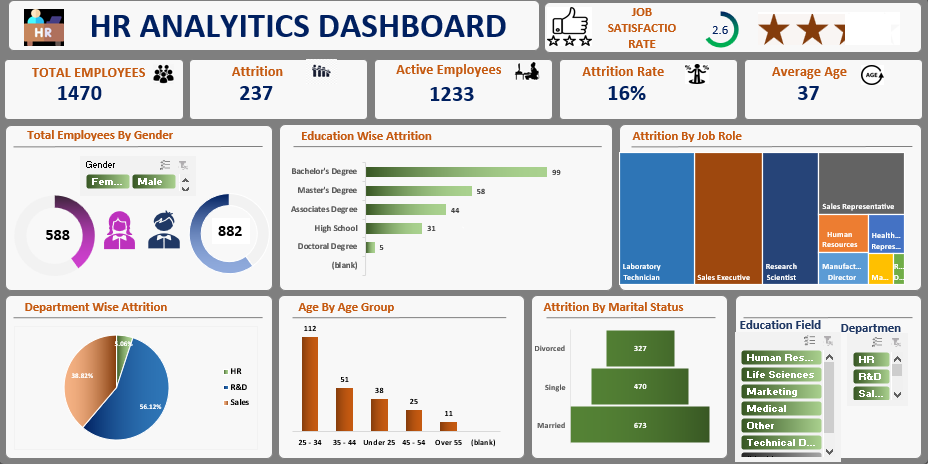

# HR Analysis Dashboard (Excel)

## 📌 Overview
This project is an interactive HR Analytics Dashboard built using Microsoft Excel to analyze employee data and HR metrics.

## 🛠️ Tools Used
- Microsoft Excel
- Pivot Tables
- Pivot Charts
- Slicers
- Conditional Formatting

## 📊 Key Metrics
- Total Employees: 1470
- Active Employees: 1233
- Attrition: 237
- Attrition Rate: 16%
- Average Age: 37

## 📈 Dashboard Features
- Employee Gender Analysis
- Department-wise Attrition
- Education-wise Attrition
- Job Role Analysis
- Age Group Analysis
- Marital Status Analysis
- Interactive Slicers

## 🖼️ Dashboard Preview

